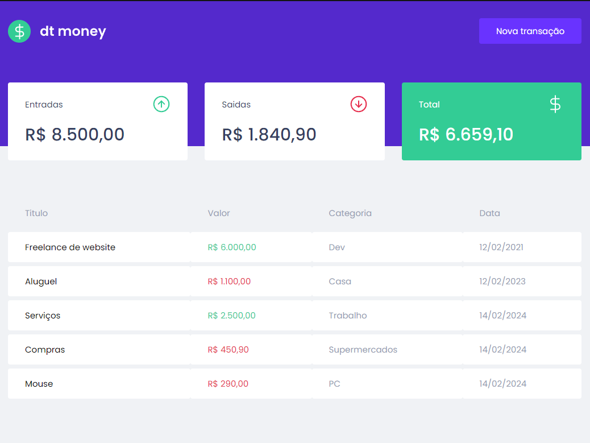

# 📚 Sobre

Uma aplicação de controle financeiro para o usuário. Nele você pode adicionar as entradas e saídas financeiras do seu dia-a-dia.

# 🚀 Tecnologias e bibliotecas

- [**ReactJS**]
- [**TypeScript**]
- [**useState**] (hook que armazena dados que podem variar com o tempo, qualquer informação ou dado deve ser armazenado no useState, só assim será possível renderizar a informação para o frontend web ou mobile)
- [**useEfect**] (hook utilizado para controlar a execução de uma função a partir da alteração de um determinado parâmetro)
- [**Context API**] (compartilhamento de estado entre vários componentes da aplicação, utiliza o hook useContext())
- [**Styled Components**] (biblioteca que permite escrever códigos CSS dentro do Javascript)
- [**Mirage JS**] (biblioteca de simulação de API que permite construir, testar e compartilhar um aplicativo JavaScript funcional completo antes de ser desenvolvido o back-end)
- [**React Modal**] (biblioteca que renderiza o conteúdo de seu filho sobre um componente backdrop e fornece muitos recursos relacionados a interação destes dois)
- [**Polished**] (biblioteca que possui funções otimizadas de estilos para usar no JavaScript, como darken e transparentize)

# 💻 Como executar

**Você precisa instalar o [Node.js](https://nodejs.org/en/download/) e o [Yarn](https://yarnpkg.com/) primeiro, depois:**

### Instalar Dependências e execulção da aplicação

```bash
yarn install

yarn start
```

Abra [http://localhost:3000](http://localhost:3000) no seu navegador para ver o resultado.
`<br>`

# 🔖 Layout

<div align="center">
  
</div>

## 🧑‍🦰 Autor

Wendrell Possato Oliveira

## Inspiração

Os códigos foram desenvolvidos durante as aulas do Chapter II da trilha de ReactJS do Bootcamp Ignite da Rocketseat. Este projeto serve como inspiração e referência, sendo adaptado e personalizado para fins educacionais.

## Licença

Este projeto está licenciado sob a Licença MIT - veja o arquivo [LICENSE](./LICENSE) para mais detalhes.
